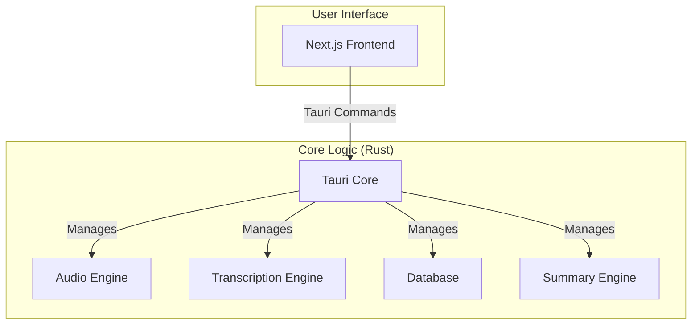

# System Architecture

Pund-IT Meeting Assistant is a self-contained desktop application built with [Tauri](https://tauri.app/). It combines a Rust-based backend with a Next.js frontend into a single, efficient, and cross-platform application.

## High-Level Architecture Diagram

## Component Details

### Frontend (Next.js)

*   Provides the user interface for managing meetings, displaying transcriptions, and configuring the application.
*   Communicates with the Rust core through Tauri's command system.

### Backend (Rust Core)

*   **Tauri Core:** The heart of the application, responsible for managing the window, handling events, and exposing the Rust core to the frontend.
*   **Audio Engine:** Captures audio from the microphone and system, processes it, and prepares it for transcription.
*   **Transcription Engine:** Uses local speech-to-text models (Whisper or Parakeet) to transcribe the captured audio. It can be accelerated with a GPU.
*   **Database:** A local SQLite database that stores meeting metadata, transcripts, and summaries.
*   **Summary Engine:** Generates meeting summaries using various Large Language Models (LLMs), including local models via Ollama.

## Provider and integration boundaries

Transcription and SQLite persistence are local. Summary generation may send transcript text/prompts to a configured external provider or remote Ollama/custom endpoint; see [Privacy policy](../PRIVACY_POLICY.md). The paired browser extension calls an authenticated loopback service for recording control, not transcript export. This rebrand adds no Ops Hub or ticket-attachment feature.
